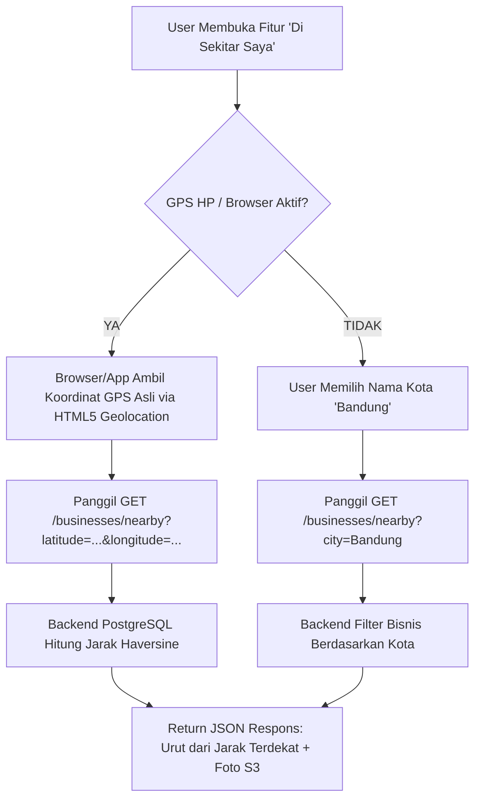

# 📌 Dokumentasi Fitur: Endpoint Bisnis Terdekat Berbasis GPS (GET /businesses/nearby)

---

## 🎯 1. Pendahuluan & Tujuan
Fitur **"Tempat di Sekitar Saya" (Nearby Businesses)** memungkinkan pengguna menemukan tempat bisnis terdekat dari titik lokasi GPS mereka secara *realtime*. 

### 💡 Keunggulan Utama:
1. **100% Bebas Biaya API**: Tidak memerlukan Google Maps API untuk mencari koordinat/jarak bisnis.
2. **Perhitungan Presisi**: Menggunakan **Rumus Haversine** yang dieksekusi secara instan langsung di dalam database PostgreSQL.
3. **Data Lengkap Foto S3**: Setiap tempat terdekat yang dihasilkan mengembalikan URL gambar publik dari AWS S3.

---

## 🌐 2. Alur Geolocation (Frontend vs Backend)



---

## 🧮 3. Rumus Kalkulasi Jarak (Haversine Formula)

Backend menghitung jarak lingkaran besar (*Great-circle distance*) antara koordinat lokasi user $(\text{lat}_1, \text{lon}_1)$ dengan koordinat lokasi bisnis $(\text{lat}_2, \text{lon}_2)$ langsung di query SQL:

$$d = 6371 \times \arccos\left(\cos(\text{radians}(\text{lat}_1)) \cdot \cos(\text{radians}(\text{lat}_2)) \cdot \cos(\text{radians}(\text{lon}_2) - \text{radians}(\text{lon}_1)) + \sin(\text{radians}(\text{lat}_1)) \cdot \sin(\text{radians}(\text{lat}_2))\right)$$

---

## 🧪 4. Panduan Praktek Pengujian di Postman

### 1️⃣ Skenario 1: Pencarian Berbasis GPS (Latitude & Longitude)

#### 📥 Request Postman:
* **HTTP Method**: `GET`
* **URL**: `http://localhost:3000/businesses/nearby?latitude=-6.917464&longitude=107.619122&radius=5&limit=10`

#### 📋 Query Parameters:
| Key | Value | Description |
| :--- | :--- | :--- |
| `latitude` | `-6.917464` | Koordinat GPS Latitude user (Contoh: Alun-alun Bandung) |
| `longitude` | `107.619122` | Koordinat GPS Longitude user |
| `radius` | `5` | Radius jangkauan maksimal 5 kilometer |
| `limit` | `10` | Maksimal 10 bisnis terdekat |

#### 📤 Response JSON (`200 OK`):
```json
{
  "success": true,
  "message": "Berhasil menemukan bisnis terdekat dalam radius 5 km",
  "data": {
    "user_location": {
      "latitude": -6.917464,
      "longitude": 107.619122,
      "radius_km": 5
    },
    "total_found": 3,
    "businesses": [
      {
        "id": "5b922fc2-6354-405e-b397-1b1390351872",
        "name": "Wisma Kartini",
        "slug": "wisma-kartini",
        "address": "Wisma Kartini",
        "city": "Bandung City",
        "province": "West Java",
        "latitude": -6.9177496,
        "longitude": 107.6167244,
        "distance_km": 0.27,
        "category": "internet_access.free",
        "rating": 4.5,
        "reviews_count": 12,
        "logo_url": "https://transgo-minio.s3.ap-southeast-1.amazonaws.com/kabarify/places/place_516b0c49eb75e75a4059e1f6db85cdab1bc0f001.jpg",
        "cover_url": "https://transgo-minio.s3.ap-southeast-1.amazonaws.com/kabarify/places/place_516b0c49eb75e75a4059e1f6db85cdab1bc0f001.jpg",
        "photos": [
          "https://transgo-minio.s3.ap-southeast-1.amazonaws.com/kabarify/places/place_516b0c49eb75e75a4059e1f6db85cdab1bc0f001.jpg"
        ],
        "is_claimed": false,
        "status": "ACTIVE"
      },
      {
        "id": "2c4b3b9b-ae01-419a-9277-6e7b9782470c",
        "name": "Buton Backpackers Lodge",
        "slug": "buton-backpackers-lodge",
        "address": "Buton Backpackers Lodge",
        "city": "Bandung City",
        "province": "West Java",
        "latitude": -6.9186417,
        "longitude": 107.615306,
        "distance_km": 0.44,
        "category": "accommodation.hostel",
        "rating": 4.5,
        "reviews_count": 12,
        "logo_url": "https://transgo-minio.s3.ap-southeast-1.amazonaws.com/kabarify/places/place_5116c26a2c61e75a4059a6f7e868b0ac1bc0f001.jpg",
        "cover_url": "https://transgo-minio.s3.ap-southeast-1.amazonaws.com/kabarify/places/place_5116c26a2c61e75a4059a6f7e868b0ac1bc0f001.jpg",
        "photos": [
          "https://transgo-minio.s3.ap-southeast-1.amazonaws.com/kabarify/places/place_5116c26a2c61e75a4059a6f7e868b0ac1bc0f001.jpg"
        ],
        "is_claimed": false,
        "status": "ACTIVE"
      },
      {
        "id": "4a385fbf-1db9-4380-872d-6bd0bbda06c5",
        "name": "Chara Hotel Bandung",
        "slug": "chara-hotel-bandung",
        "address": "Chara Hotel Bandung",
        "city": "Bandung City",
        "province": "West Java",
        "latitude": -6.9223207,
        "longitude": 107.6197044,
        "distance_km": 0.54,
        "category": "building.accommodation",
        "rating": 4.5,
        "reviews_count": 12,
        "logo_url": "https://transgo-minio.s3.ap-southeast-1.amazonaws.com/kabarify/places/place_510721a53ca9e75a40590f85a5d974b01bc0f001.jpg",
        "cover_url": "https://transgo-minio.s3.ap-southeast-1.amazonaws.com/kabarify/places/place_510721a53ca9e75a40590f85a5d974b01bc0f001.jpg",
        "photos": [
          "https://transgo-minio.s3.ap-southeast-1.amazonaws.com/kabarify/places/place_510721a53ca9e75a40590f85a5d974b01bc0f001.jpg"
        ],
        "is_claimed": false,
        "status": "ACTIVE"
      }
    ]
  }
}
```

---

### 2️⃣ Skenario 2: Fallback Tanpa GPS (Pencarian Nama Kota `city`)

Jika GPS HP dimatikan oleh pengguna:
* **URL**: `http://localhost:3000/businesses/nearby?city=Jakarta`
* **Response**: Mengembalikan daftar bisnis populer di kota Jakarta.

---

## 📋 Command cURL untuk Import Langsung ke Postman

```bash
curl --location --request GET 'http://localhost:3000/businesses/nearby?latitude=-6.917464&longitude=107.619122&radius=5&limit=10'
```
